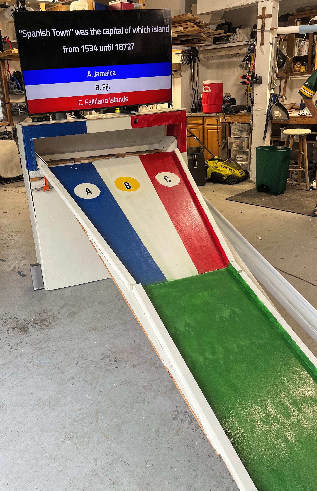
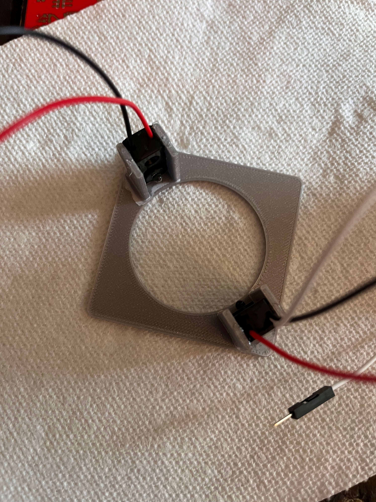
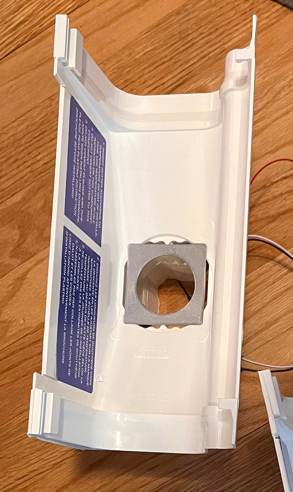

# Mini Golf Trivia

A bit hard to explain this one. 
Some friends were getting married who were into both golf and trivia, somehow this became an idea - so I built it.

## Overview
 - The main server just picks questions and waits for them to be answered.
   Questions are supplied in a CSV and there is an example of the format in `questions.csv`.
 - There's a little React app that displays the questions on a tv above the golf hole.
 - The questions are made by putting the ball into one of the buckets at the end of the lanes.
   The buckets have a 3d printed bracket into a gutter with [IR Break Beam Sensors](https://www.adafruit.com/product/2168) on either side.
-  [ESPHome](https://esphome.io) runs on a [Wemo ESP32 D1 mini](https://docs.platformio.org/en/stable//boards/espressif32/wemos_d1_mini32.html) which registers the beams being broken.
   This communicates with the Raspberry PI running the main server app over USB/Serial.

## Bill of materials
 - [IR Break Beam Sensors](https://www.adafruit.com/product/2168)
 - [D1 ESP32 Mini](https://a.co/d/75bo641)
 - [Raspberry Pi 4](https://www.raspberrypi.com/products/raspberry-pi-4-model-b/)
 - [Gutter Outlets](https://www.menards.com/main/building-materials/roofing-soffits-gutters/gutters-accessories/gutter-fittings/kp-u-snap-trade-vinyl-gutter-drop-outlet/u11551/p-1444437124372-c-1492703914555.htm?tid=-7656841813897888853&ipos=4)

Then a bunch of guttering, wood and paint for the rest of it.

## 3D Models

The models directory contains a Fusion360 model and exported STL for a bracket for holding the IR sensors in the mount of the gutter outlet.
I just used some CA glue to hold the sensors in the holders.

## Reference
 - [Raspberry Pi 4 Kiosk Setup](https://pimylifeup.com/raspberry-pi-kiosk/)
 - [All sound effects were taken from myinstants.com](https://www.myinstants.com/)